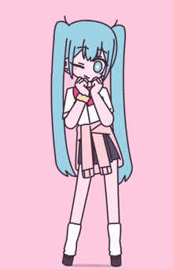
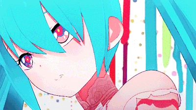
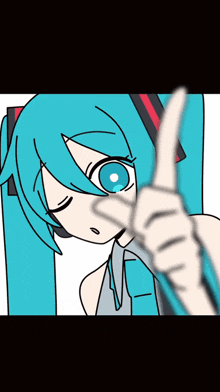
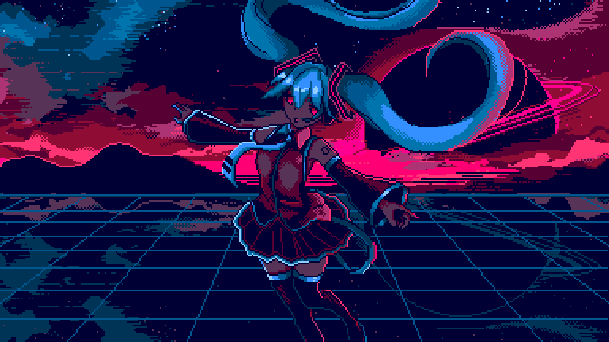

<!-- ░░░ HERO HEADER ░░░ -->

 

  

<!-- status badges -->

&nbsp;

&nbsp;

  

 

&nbsp;&nbsp;

&nbsp;&nbsp;

&nbsp;&nbsp;

 

 

<!-- ░░░ ABOUT ░░░ -->

<h2>◆ &nbsp; A B O U T &nbsp; ◆</h2>

 

<table>
  <tr>
    <td align="center" width="55%" valign="top">
       
      

        &nbsp;&nbsp;&nbsp;&nbsp;Software Engineer with a track record of owning increasingly complex systems and serving as a key technical contact for client-facing initiatives. Experienced in leading end-to-end feature development, architecting scalable production processes, and driving engineering quality through refactoring, automation, and best practices. Contributor to technical decision-making and a mentor to junior engineers — turning requirements into robust, maintainable solutions.
      

       
      
        
      
        
      
        
    </td>
    <td align="center" width="45%" valign="middle">
      
        
      
    </td>
  </tr>
</table>

 

 

<!-- ░░░ CAREER EVOLUTION ░░░ -->

<h2>☆ &nbsp; C A R E E R &nbsp; E V O L U T I O N &nbsp; ☆</h2>

 

  

<table>
  <tr>
    <!-- PHASE 01 -->
    <td align="center" width="33%" valign="top">
      
        
      
        
      <strong>🌱 Software Programmer</strong>
       
      <i>Python y Desarrollo de Software</i>
        
      
        
      

        
          ▸ Developed and maintained Python-based tools 
          ▸ Automated processes within existing systems 
          ▸ Implemented features & resolved defects 
          ▸ Ensured smooth operation of workflows 
          ▸ Mastered version control & debugging 
          ▸ Delivered reliable code collaboratively
        
      

    </td>
    <!-- PHASE 02 -->
    <td align="center" width="33%" valign="top">
      
        
      
        
      <strong>🔧 Software Engineer (Analyst)</strong>
       
      <i>Architecture · Workflows · Clients</i>
        
      
        
      

        
          ▸ Designed & optimized production workflows 
          ▸ Implemented feature enhancements end-to-end 
          ▸ Translated operational needs → tech specs 
          ▸ Improved Python performance & reliability 
          ▸ Applied software architecture fundamentals 
          ▸ Led cross-functional communication
        
      

    </td>
    <!-- PHASE 03 -->
    <td align="center" width="33%" valign="top">
      
        
      
        
      <strong>🚀 Software Engineer II (Associate)</strong>
       
      <i>Leadership · Systems · Decisions</i>
        
      
        
      

        
          ▸ Owned increasingly complex systems 
          ▸ Key technical contact for client initiatives 
          ▸ Led end-to-end feature development 
          ▸ Drove quality via refactoring & automation 
          ▸ Contributed to technical decision-making 
          ▸ Mentored junior team members
        
      

    </td>
  </tr>
</table>

 

<!-- progression arrow -->

 

 

<!-- ░░░ CAPABILITIES ░░░ -->

<h2>◆ &nbsp; C A P A B I L I T I E S &nbsp; ◆</h2>

 

<table>
  <tr>
    <td align="center" width="50%" valign="top">
       
      <table>
        <tr>
          <td align="center" width="48%">
            
              
            Designing scalable infrastructure for production-grade systems
              
          </td>
          <td align="center" width="48%">
            
              
            End-to-end ownership &amp; strategic decision-making
              
          </td>
        </tr>
        <tr>
          <td align="center">
            
              
            Critical workflow optimization and reliability at scale
              
          </td>
          <td align="center">
            
              
            Refactoring, automation, and testing strategies
              
          </td>
        </tr>
        <tr>
          <td align="center">
            
              
            Translating requirements into technical specs
              
          </td>
          <td align="center">
            
              
            Supporting &amp; growing junior engineers
              
          </td>
        </tr>
      </table>
    </td>
    <td align="center" width="50%" valign="middle">
      
        
      
    </td>
  </tr>
</table>

 

 

<!-- ░░░ TOOLKIT ░░░ -->

<h2>◇ &nbsp; T O O L K I T &nbsp; ◇</h2>

 

<!-- core language -->

&nbsp;

&nbsp;

  

<!-- practices -->

&nbsp;

&nbsp;

  

<!-- soft -->

&nbsp;

&nbsp;

  

&nbsp;

&nbsp;

 

 

<!-- ░░░ STATS ░░░ -->

<h2>◈ &nbsp; S T A T S &nbsp; ◈</h2>

 

 

<table>
  <tr>
    <td align="center">
      
    </td>
    <td align="center">
      
    </td>
    <td align="center">
      
    </td>
  </tr>
</table>

 

  

 

 

<!-- ░░░ PRINCIPLES ░░░ -->

<h2>♪ &nbsp; E N G I N E E R I N G &nbsp; P R I N C I P L E S &nbsp; ♪</h2>

 

  

&nbsp;

&nbsp;

  

&nbsp;

&nbsp;

 

<!-- ░░░ FOOTER ░░░ -->

 

 

&nbsp;

&nbsp;

  

